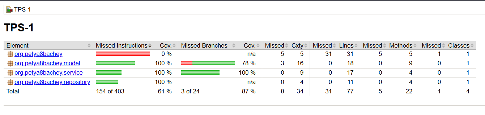

# TPS-1: Система управления продуктами
Результаты тестов
```asciidoc
[INFO] -------------------------------------------------------
[INFO]  T E S T S
[INFO] -------------------------------------------------------
[INFO] Running org.petya8bachey.model.ProductTest
[INFO] Tests run: 6, Failures: 0, Errors: 0, Skipped: 0, Time elapsed: 0.220 s -- in org.petya8bachey.model.ProductTest
[INFO] Running org.petya8bachey.repository.InMemoryProductRepositoryTest
[INFO] Tests run: 5, Failures: 0, Errors: 0, Skipped: 0, Time elapsed: 0.024 s -- in org.petya8bachey.repository.InMemoryProductRepositoryTest
[INFO] Running org.petya8bachey.service.ProductServiceTest
OpenJDK 64-Bit Server VM warning: Sharing is only supported for boot loader classes because bootstrap classpath has been appended
[INFO] Tests run: 8, Failures: 0, Errors: 0, Skipped: 0, Time elapsed: 2.917 s -- in org.petya8bachey.service.ProductServiceTest
[INFO] 
[INFO] Results:
[INFO] 
[INFO] Tests run: 19, Failures: 0, Errors: 0, Skipped: 0
[INFO] 
[INFO] 
[INFO] --- jacoco:0.8.10:report (report) @ TPS-1 ---
[INFO] Loading execution data file C:\Users\user\IdeaProjects\TPS-1\target\jacoco.exec
[INFO] Analyzed bundle 'TPS-1' with 4 classes
[INFO] ------------------------------------------------------------------------
```

## Описание проекта
Проект представляет собой простую систему управления продуктами с возможностью проверки их доступности и совершения покупок. Реализованы следующие функции:
- Хранение информации о продуктах (ID, название, цена, количество на складе)
- Проверка доступности продукта в нужном количестве
- Возможность "покупки" продукта с уменьшением его количества на складе

## Технологии
- Java 17
- Maven
- JUnit 5 (для тестирования)
- Mockito (для мокирования в тестах)
- JaCoCo (для анализа покрытия кода тестами)

## Структура проекта
```
src/
├── main/
│   ├── java/
│   │   └── org/petya8bachey/
│   │       ├── Main.java            # Основной класс для демонстрации
│   │       ├── model/               # Модели данных
│   │       │   └── Product.java
│   │       ├── repository/         # Репозитории для работы с данными
│   │       │   ├── InMemoryProductRepository.java
│   │       │   └── ProductRepository.java
│   │       └── service/            # Бизнес-логика
│   │           └── ProductService.java
│   └── resources/
└── test/
    └── java/
        └── org/petya8bachey/
            ├── model/
            │   └── ProductTest.java
            ├── repository/
            │   └── InMemoryProductRepositoryTest.java
            └── service/
                └── ProductServiceTest.java
```

## Запуск проекта
1. Убедитесь, что установлены:
   - JDK 17+
   - Maven 3.8+
2. Клонируйте репозиторий
3. Соберите проект: `mvn clean install`
4. Запустите приложение: `mvn exec:java -Dexec.mainClass="org.petya8bachey.Main"`

## Тестирование
- Запуск всех тестов: `mvn test`
- Генерация отчета о покрытии кода (после тестов): `mvn jacoco:report`
  - Отчет будет доступен в `target/site/jacoco/index.html`

## Демонстрация работы
Пример работы приложения можно увидеть в классе `Main.java`, который демонстрирует:
- Проверку доступности продуктов
- Процесс покупки продуктов
- Обработку некорректных входных данных
